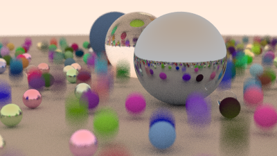

# swift-raytracing

[Raytracing in One Weekend](https://raytracing.github.io/books/RayTracingInOneWeekend.html) in [swift](https://www.swift.org/) for linux
## Book 1 

ported from my [rust version](https://github.com/jeremythorne/raytracing)

## Book 2

Motion Blur

